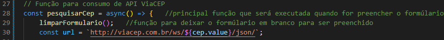
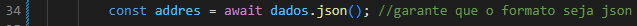
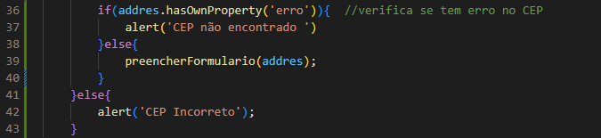
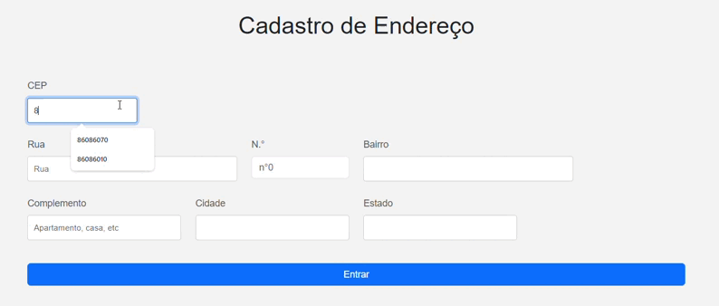

# Projeto de cadastro de Endereço com consumo de API (viaCEP)

 # `ÍNDICE`
 
* [Introdução](#introdução)
* [Descrição](#descrição)
* [Funcionalidades](#funcionalidades)
* [Propriedades](#propriedades)
* [Resultados](#resultado)
* [Tecnologias utilizadas](#tecnologias-utilizadas)
* [Autores](#autores)
 
 
## `Introdução`
  O formulario de cadastro de CEP facilita coleta e o gerenciamento de informações relacionadas a endereços.
O usuário pode inserir dados como CEP, logradouro, número, bairro, complemento, localidade e unidade federativa (UF). Esses dados são fundamentais para a identificação correta de endereços e ajudam a garantir a eficiência em serviços como transporte, entregas e comunicação.
 
## `Descrição`
    O API (Interface de Programação de Aplicações) em um código JavaScript que utiliza CEP (Código de Endereçamento Postal) serve para acessar dados relacionados a endereços, onde ele autopreenche dados, valida CEPs, conecta seu sistema a bancos de dados ou serviços que utilizam informações de endereços, como e-commerce.
 
 
## `Funcionalidades`
 
### O API (Interface de Programação de Aplicações) em um código JavaScript que utiliza CEP (Código de Endereçamento Postal) serve para acessar dados relacionados a endereços, onde ele autopreenche dados, valida CEPs, conecta seu sistema a bancos de dados ou serviços que utilizam informações de endereços, como e-commerce.
 
## `Introdução ao ASYNC, AWAIT, FETCH, e ARRAY`

### `ASYNC` : É utilizado para declarar uma função assíncrona em JavaScript. Isso significa que a função pode realizar tarefas que levam tempo, como requisições de rede, sem bloquear o resto do código. Quando você marca uma função como ASYNC, ela sempre retorna uma Promise. Com isso, você pode escrever código que parece sequencial, tornando-o mais fácil de entender.
 

 
 ### `AWAIT` : O AWAIT só pode ser usado dentro de funções ASYNC. Ele pausa a execução da função até que a Promise seja resolvida ou rejeitada, tornando o código mais fácil de entender e permitindo um fluxo de controle mais linear.
 
 
### `FETCH` : FETCH é uma API nativa do JavaScript que permite realizar requisições HTTP de forma assíncrona. Ela retorna uma Promise que resolve a resposta da requisição. O método FETCH é amplamente utilizado para buscar dados de APIs.

### `ARRAY`
    A função ARRAY e suas funcionalidades permitem que desenvolvedores em JavaScript gerenciem coleções de dados de maneira eficiente e expressiva, tornando a manipulação de dados muito mais fácil e poderosa.

 
### `EXPRESSÃO REGULAR`
    As EXPRESSÕES REGULARES são uma ferramenta extremamente útil em JavaScript para manipulação de strings, permitindo que desenvolvedores criem funções robustas para validação e processamento de dados de forma eficiente.
 
 
## `Resultado`

 
## `Tecnologias utilizadas`
 - [Bootstrap](https://getbootstrap.com/docs/5.3/forms/layout/)
 - Javascript
 - HTML5
 - CSS3
 - ChatGPT ( para resumos )
 
 
## `Autores`
[Leonardo Rocha](https://github.com/LeonardoRochaMarista/LeonardoRochaMarista)
[Camila Casagrande Garcia](https://github.com/camilacasagrande)
[Maria Isabel](https://github.com/belsil5aa)
